# Ambassador Android SDK
_**Support Level**_: API 16+ (4.1+)

## Getting Started

Install Git hooks:

```sh
$ ln -s ../../git-hooks/prepare-commit-msg .git/hooks/prepare-commit-msg
$ ln -s ../../git-hooks/pre-push .git/hooks/pre-push
```

The `pre-push` hook requires re-initialization of the repo:

```sh
$ git init
```

Make sure the `pre-push` hook is executable:

```sh
$ chmod +x .git/hooks/pre-push
```

## Documentation
## Installing the SDK

Follow these steps to add the Ambassador SDK to your Android Studio project.

_**Note**_: Make sure you have the latest version of **Android Studio** installed.

* Download the zip file, unzip it, and leave the **'ambassador'** folder on your
desktop or another place that you can easily access.

 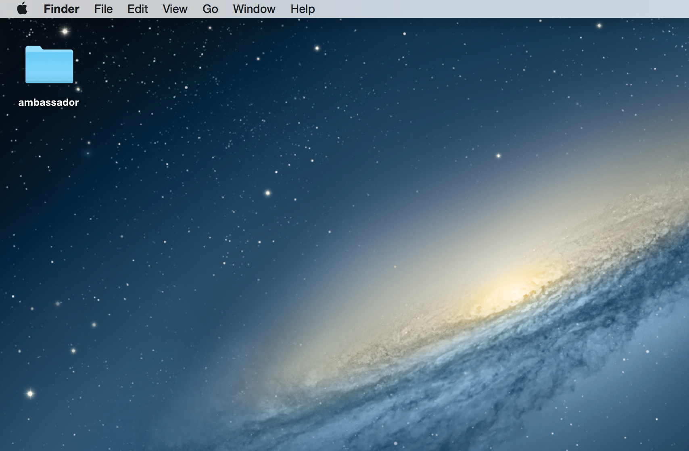

 * Open your project's top-level Gradle file

  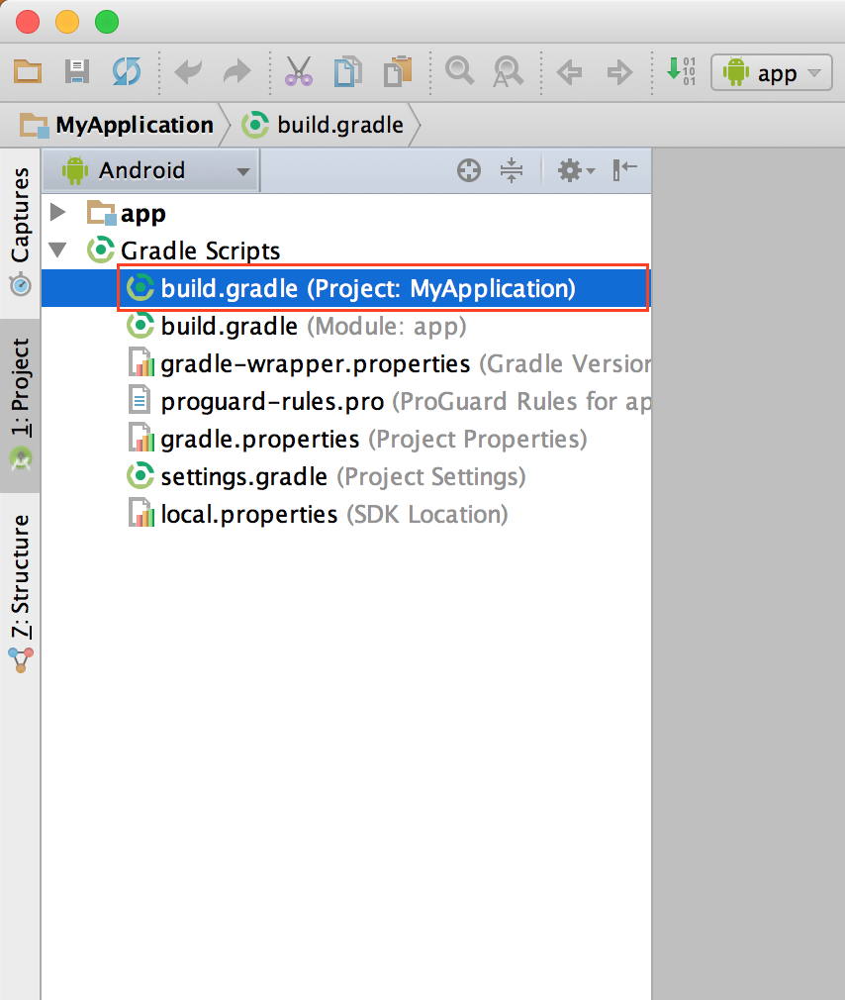

 * Add the following line under the dependencies section

  ```java
  classpath 'com.neenbedankt.gradle.plugins:android-apt:1.7'
  ```
  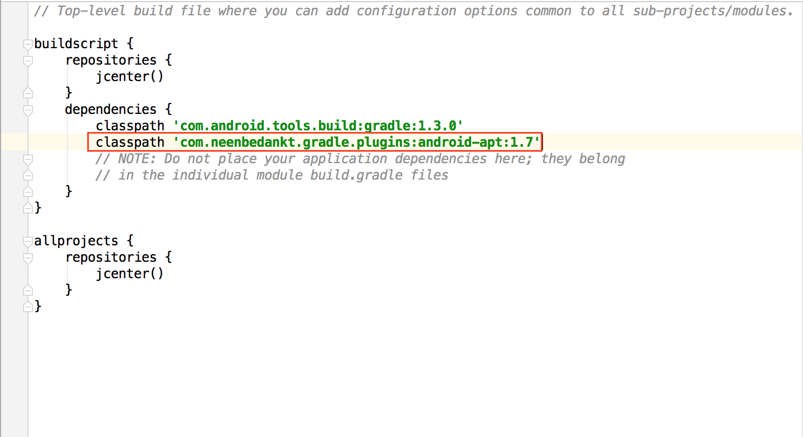

* Open your project's structure by selecting **File -> Project Stucture** in the Menu Bar to bring up a dialog in Android Studio.

 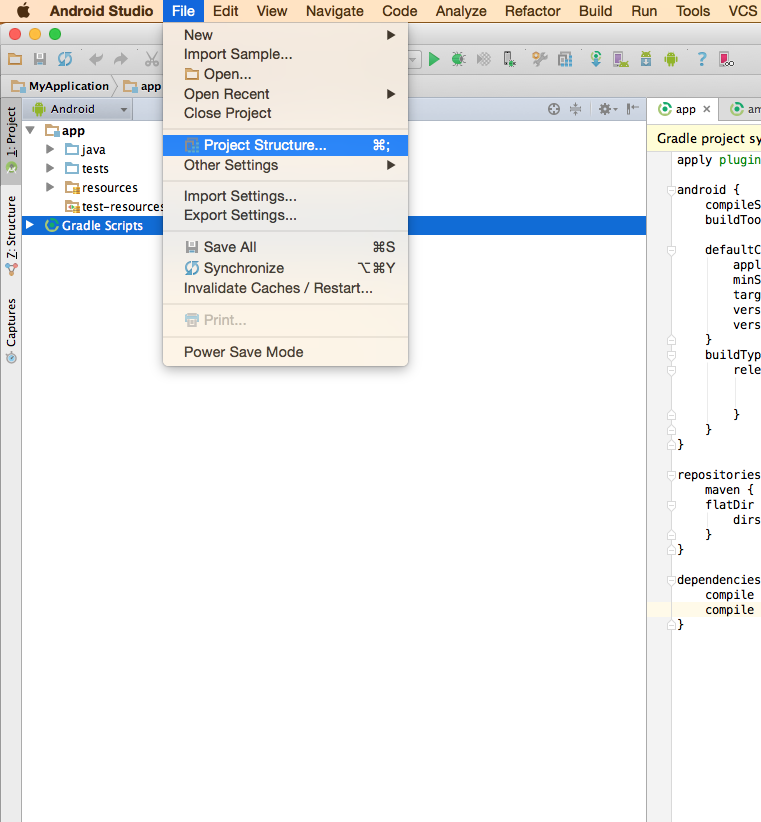

* Click the **'+'** sign in the top left corner of the dialog.

 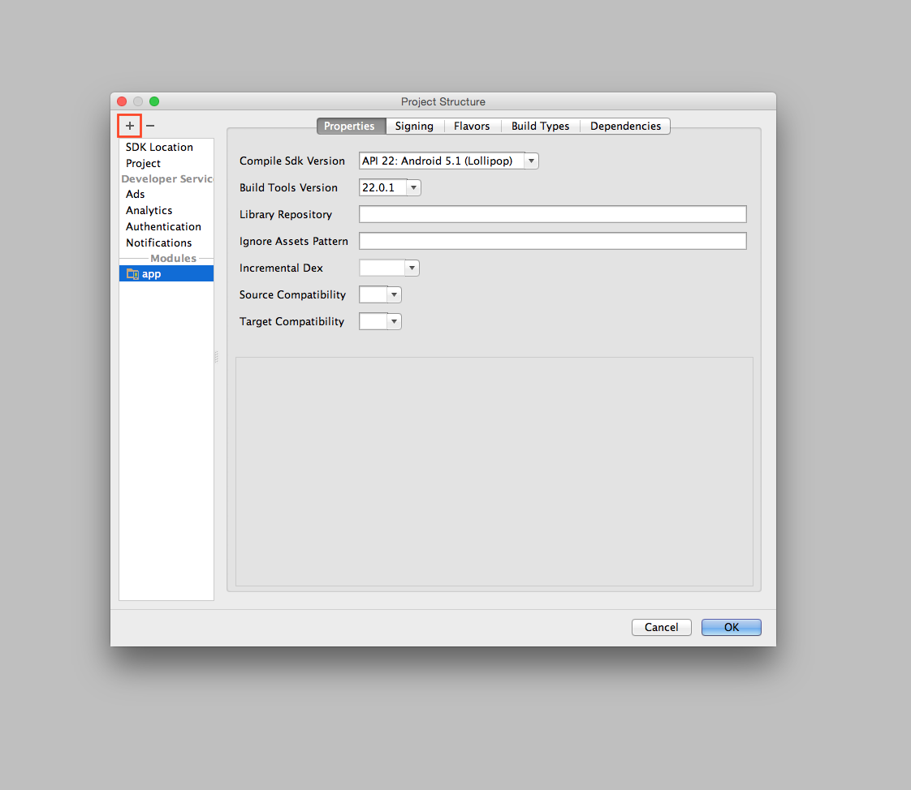

* Select the **'Import Gradle Project'** option and click **'Next'**.

 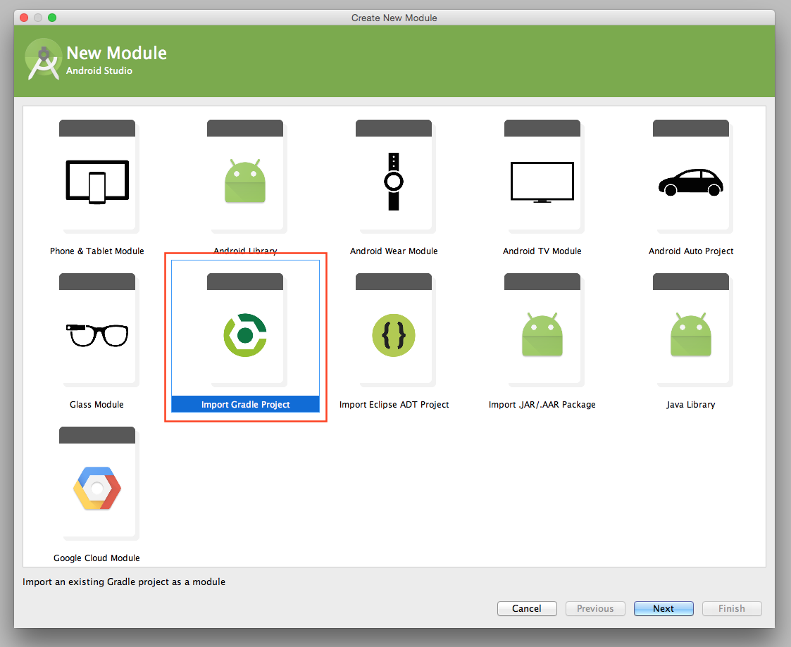

* Tap the **'...'** button and locate the **'ambassador'** folder where you chose to save it.

 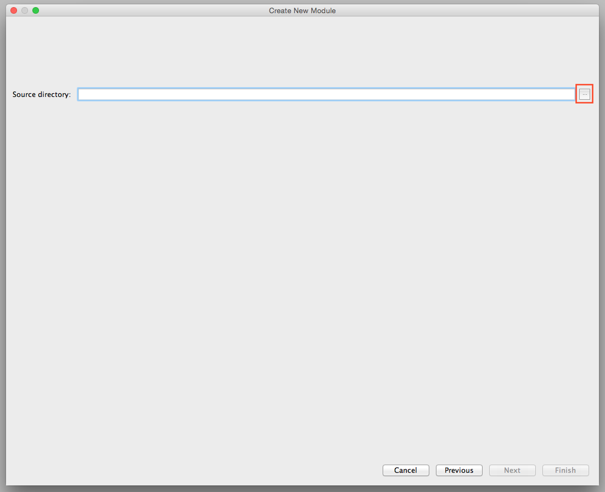

* Select the **'ambassador'** folder and click **'OK'**.

 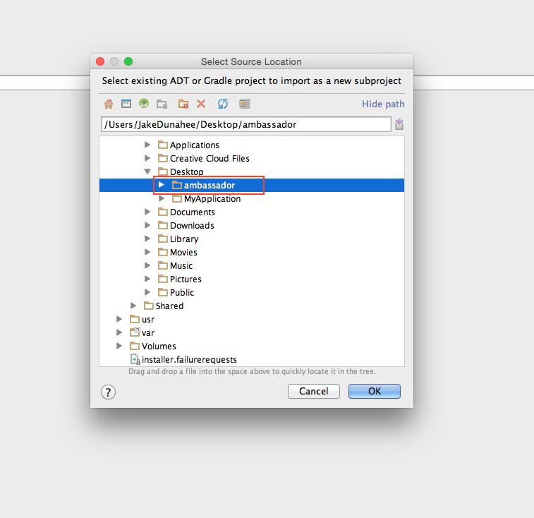

* Click **'Finish'** and once the modal is closed, give Android Studio a moment to finish creating the module. Android Studio may take several minutes.

 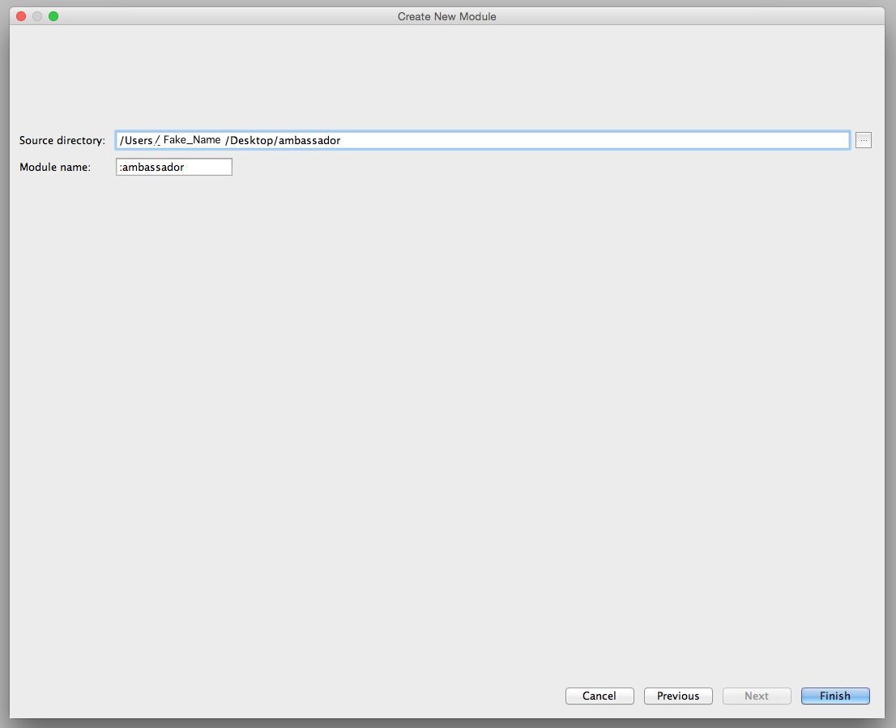

* Once the Ambassador module has been created and added to the project, it should appear in the **Project Structure**.  You can then click the **'OK'** button to dismiss the Project Structure dialog.

 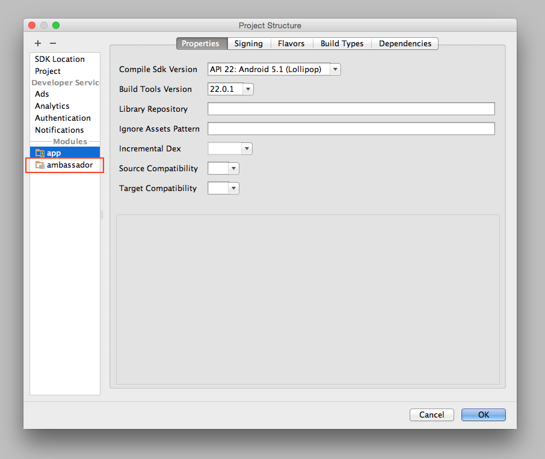

## Modify your app's Gradle file

* Open your app's **Gradle** file that can be found in the **Project** view.

 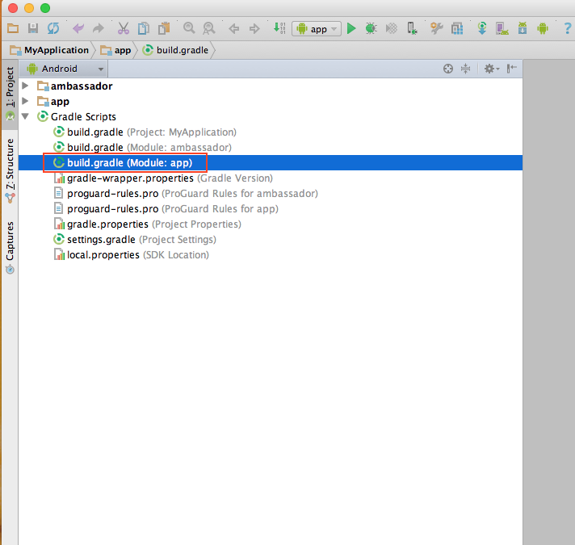

* Add the **repositories** code and the **ambassador module** to your Gradle file with the following code:

 ```java
 repositories {
     maven { url 'http://clojars.org/repo'}
     flatDir { dirs '../ambassador/libs' }
 }
 ```

  ```java
  compile project(':ambassador')
  ```

* You will want to make sure your compileSdkVersion and buildToolsVersion are set to the latest API version. While our SDK requires this to be a minimum of 23, this is also a best practice for Android development.

 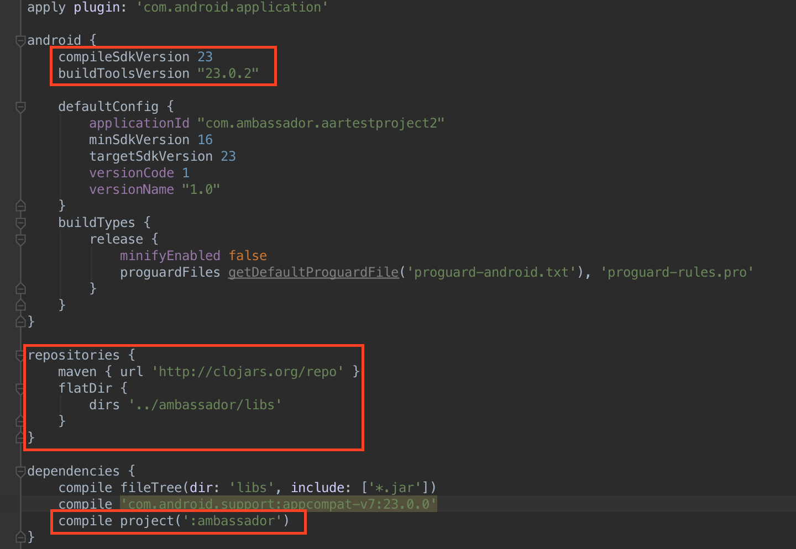

* Now sync your project's gradle.

## Initializing Ambassador

 You will want to run Ambassador in your application as early in the application lifecycle as possible.  The ideal place to run would be in the **onCreate()** method of your **MainActivity**.  You will have the option to register a **conversion** the first time the app is launched.  You can read more on **conversions** and setting their parameters in [Conversions](#conversions).

 * _Note_: Your **Universal Token** and **Universal ID** will be provided to you by Ambassador.

  ```java
  @Override
  protected void onCreate(Bundle savedInstanceState) {
      super.onCreate(savedInstanceState);
      setContentView(R.layout.activity_main);

      // Pass in your application's context as the first parameter
      AmbassadorSDK.runWithKeys(getApplicationContext(), "your_universal_key", "your_universal_ID");
  }
   ```

## Identifying a User

 In order to track referrals and provide users with custom share links, Ambassador only needs the **email address** of the user. The call to identify a user should be done early in the app to make sure all Ambassador services can be provided as soon as possible. We recommend calling it **after a successful login** or **after the initial call to run Ambassador** if you have the user's email stored.

 ```java
 AmbassadorSDK.identify("user@example.com");
 ```

## Conversions

Conversions can be triggered from anywhere.  Common places are an Activity's **onCreate()** method or on a **button click**.

 ```java
// STEP ONE: Create a ConversionParametersBuilder object
ConversionParametersBuilder builder = new ConversionParametersBuilder();

// STEP TWO: Set the REQUIRED properties
builder.setRevenue(10);
builder.setCampaign(101);
builder.setEmail("user@example.com");

// STEP THREE: Set any optional properties that you want
builder.setAddToGroupId("123");
builder.setFirstName("John");
builder.setLastName("Doe");
builder.setEmailNewAmbassador(0); // Boolean represented by int (Defaults to false)
builder.setUid("mbsy_uid");
builder.setCustom1("custom");
builder.setCustom2("custom");
builder.setCustom3("custom");
builder.setAutoCreate(1); // Boolean represented by int (Defaults to true);
builder.setDeactivateNewAmbassador(0); // Boolean represented by int (Defaults to false)
builder.setTransactionUid("transaction_uid");
builder.setEventData1("eventData1");
builder.setEventData2("eventData2");
builder.setEventData3("eventData3");
builder.setIsApproved(1); // Boolean represented by int (Defaults to true);

// STEP FOUR: Build the object into a ConversionParameters object.
ConversionParameters conversionParameters = builder.build();

// (Also: you can chain the builder methods which is way easier)
conversionParameters = new ConversionParametersBuilder()
        .setRevenue(10)
        .setCampaign(101)
        .setEmail("user@example.com")
        .build();

// STEP FIVE: Register the conversion with the ConversionParameters object.
// The second parameter indicates that the conversion should be restricted to a user first installing your application.
AmbassadorSDK.registerConversion(conversionParameters, false);

// To register a conversion for the application's installation, the call to registerConversion would be:
AmbassadorSDK.registerConversion(conversionParameters, true);
// Note that the installation conversion will only happen once. Any subsequent usages of the app will not register this conversion.
 ```

## Present the 'Refer a Friend' Screen (RAF)

The RAF Screen provides UI components that allow users to share with their contacts to become part of your referral program.

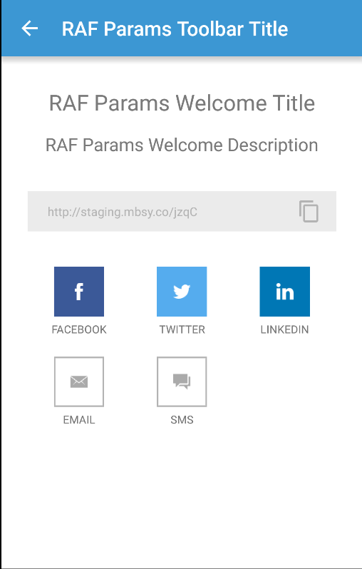   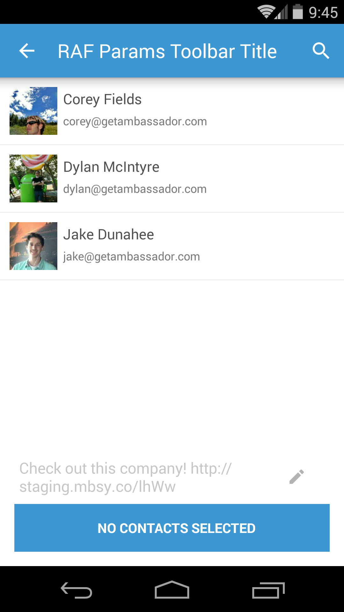

To launch the RAF Screen, simply add the following line to your application. The parameter _Context_ refers to your current context, the _String_ campaignId refers to the campaign ID you want to associate with the RAF, and the _String_ optionsPath refers to the path in your assets to an xml file with customization options.

```java
AmbassadorSDK.presentRAF(Context context, String campaignId, String optionsPath);
```
Example usage in a MainActivity:
```java
Button btnRaf = (Button)findViewById(R.id.btnRAF);
final Context context = this;
btnRaf.setOnClickListener(new View.OnClickListener() {
    @Override
    public void onClick(View v) {
        AmbassadorSDK.presentRAF(context, "305", "rafs/raf.xml");
    }
});
```

**Identify should be called BEFORE attempting to present the RAF Screen.  Identify will generate/update the short urls, and therefore should not be placed immediately before any RAF presentation calls.  This will allow the share urls to be generated for your user.  If 'Identify' is not called before, or a non-existing campaign ID is passed, you will get continuous error messages while trying to load the RAF Screen.**

#### Customizing the RAF Screen

Custom messages, colors, and font sizes are set in an xml file. Start by creating a blank .xml file and using our default values. Place this file in your assets folder:

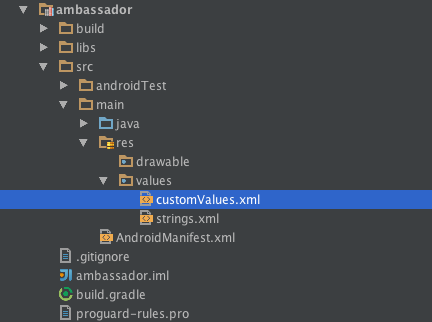

The file consists of various elements with editable properties. The colors can be replaced with any hexadecimal string (ex: #ff0000). The dimen values can be replaced with any font size. The strings can be replaced with any text you wish to show on the RAF Screen.

<!-- 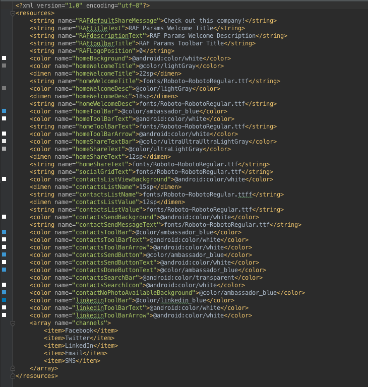 -->
```xml
<?xml version="1.0" encoding="utf-8"?>
<resources>

    <!-- MAIN ACTIVITY -->
    <string name="RAFdefaultShareMessage">Check out this company!</string>
    <string name="RAFtitleText">RAF Params Welcome Title</string>
    <string name="RAFdescriptionText">RAF Params Welcome Description</string>
    <string name="RAFtoolbarTitle">RAF Params Toolbar Title</string>
    <string name="RAFLogoPosition">0</string>
    <string name="RAFLogo">logo.png</string>

    <color name="homeBackground">@android:color/white</color>

    <color name="homeWelcomeTitle">@color/lightGray</color>
    <dimen name="homeWelcomeTitle">22sp</dimen>
    <string name="homeWelcomeTitle">fonts/Roboto-RobotoRegular.ttf</string>

    <color name="homeWelcomeDesc">@color/lightGray</color>
    <dimen name="homeWelcomeDesc">18sp</dimen>
    <string name="homeWelcomeDesc">fonts/Roboto-RobotoRegular.ttf</string>

    <color name="homeToolBar">@color/ambassador_blue</color>
    <color name="homeToolBarText">@android:color/white</color>
    <string name="homeToolBarText">fonts/Roboto-RobotoRegular.ttf</string>
    <color name="homeToolBarArrow">@android:color/white</color>

    <color name="homeShareTextBar">@color/ultraUltraUltraLightGray</color>
    <color name="homeShareText">@color/ultraLightGray</color>
    <dimen name="homeShareText">12sp</dimen>
    <string name="homeShareText">fonts/Roboto-RobotoRegular.ttf</string>

    <string name="socialGridText">fonts/Roboto-RobotoRegular.ttf</string>
    <array name="channels">
        <item>Facebook</item>
        <item>Twitter</item>
        <item>LinkedIn</item>
        <item>Email</item>
        <item>SMS</item>
    </array>
    <dimen name="socialOptionCornerRadius">0dp</dimen>
    <!-- /MAIN ACTIVITY -->

    <!-- CONTACTS ACTIVITY -->
    <color name="contactsListViewBackground">@android:color/white</color>
    <dimen name="contactsListName">15sp</dimen>
    <string name="contactsListName">fonts/Roboto-RobotoRegular.ttf</string>
    <dimen name="contactsListValue">12sp</dimen>
    <string name="contactsListValue">fonts/Roboto-RobotoRegular.ttf</string>

    <color name="contactsSendBackground">@android:color/white</color>
    <string name="contactSendMessageText">fonts/Roboto-RobotoRegular.ttf</string>

    <color name="contactsToolBar">@color/ambassador_blue</color>
    <color name="contactsToolBarText">@android:color/white</color>
    <color name="contactsToolBarArrow">@android:color/white</color>

    <color name="contactsSendButton">@color/ambassador_blue</color>
    <color name="contactsSendButtonText">@android:color/white</color>

    <color name="contactsDoneButtonText">@color/ambassador_blue</color>

    <color name="contactsSearchBar">@android:color/transparent</color>
    <color name="contactsSearchIcon">@android:color/white</color>

    <color name="contactNoPhotoAvailableBackground">@color/ambassador_blue</color>
    <!-- /CONTACTS ACTIVITY -->

    <!-- LINKEDIN LOGIN -->
    <color name="linkedinToolBar">@color/linkedin_blue</color>
    <color name="linkedinToolBarText">@android:color/white</color>
    <color name="linkedinToolBarArrow">@android:color/white</color>
    <!-- /LINKEDIN LOGIN -->

</resources>
```

For instance, if the color 'homeToolBar' is changed:

```xml
<color name="homeToolBar">#ff0000</color>
```

The resulting toolbar would display:

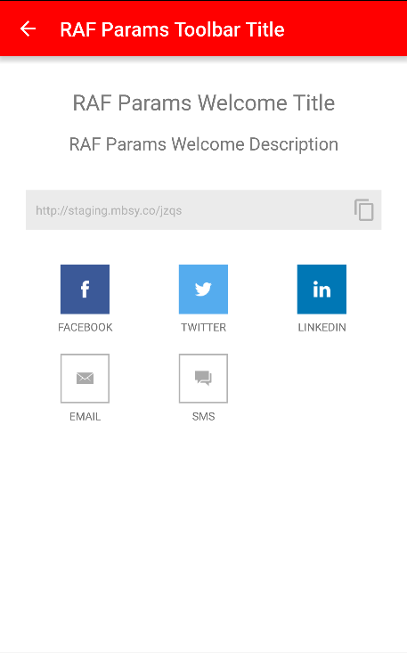

_Note_: If any values in this file are blank, the RAF will use the default values shipped with the SDK. The strings for the RAF Screen will revert to these:

* **toolbarTitle** - "Refer your friends"
* **titleText** - "Spread the word"
* **descriptionText** - "Refer a friend to get rewards"
* **defaultShareMessage** - "I'm a fan of this company, check them out!"

_Note_: The shortURL will automatically be appended to the defaultShareMessage

#### Using Custom Fonts

If you wish to use custom fonts in the Ambassador SDK, you must place them in your app's **assets/fonts** folder:

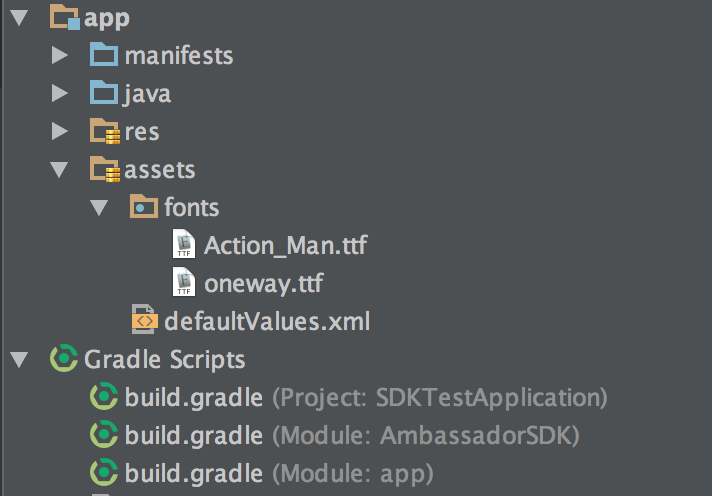

To use a custom font, insert the name of the font as `fonts/<your font name.extension>`.  Ex: `fonts/ExampleFont.ttf`:

```xml
<string name="homeWelcomeTitle">fonts/Action_Man.ttf</string>
```

By inserting the **fonts/Action_Man.ttf** value as seen above, expect the following result:

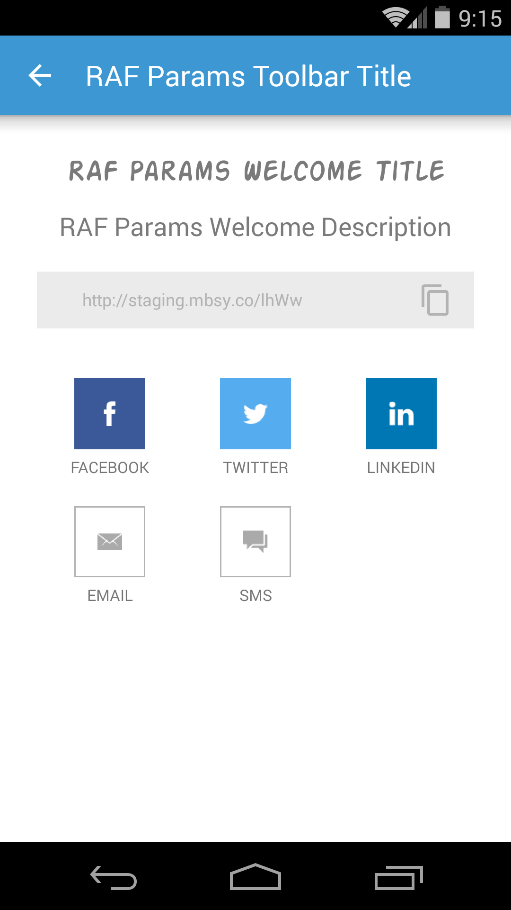

_Note_: By leaving a font value blank or entering it incorrectly, Android's default font **Roboto** will be used.

#### Using Custom Images

A custom image can be placed on the SDK Home Screen. This is commonly used for company logos.

Place the image in your app's _assets_ folder.

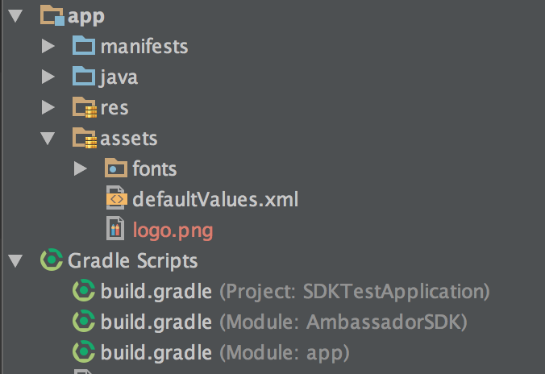

To set the position of the logo, edit the following value in customValues.xml.

```xml
<string name="RAFLogoPosition">1</string>
```

_Note_: The RAFLogoPosition element is ignored when no logo image is provided in your options xml file. Set the RAFLogoPosition to 0 to hide the logo.

The following image shows the logo in the various positions set in the custom values:

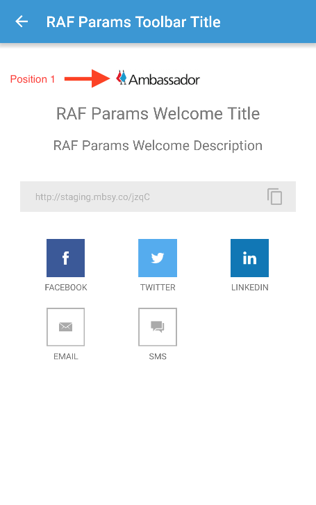

### Modifying Share Options

The share options can be disabled or reordered in customValues.xml. The share options allowed are Facebook, Twitter, LinkedIn, Email, and SMS. These strings are _not_ case sensitive.

```xml
<array name="channels">
    <item>Facebook</item>
    <item>Twitter</item>
    <item>LinkedIn</item>
    <item>Email</item>
    <item>SMS</item>
</array>
```

#### Disabling Share Options

To disable a share option, remove it from the array.

```xml
<array name="channels">
    <item>Facebook</item>
    <item>Twitter</item>
    <item>Email</item>
    <item>SMS</item>
</array>
```

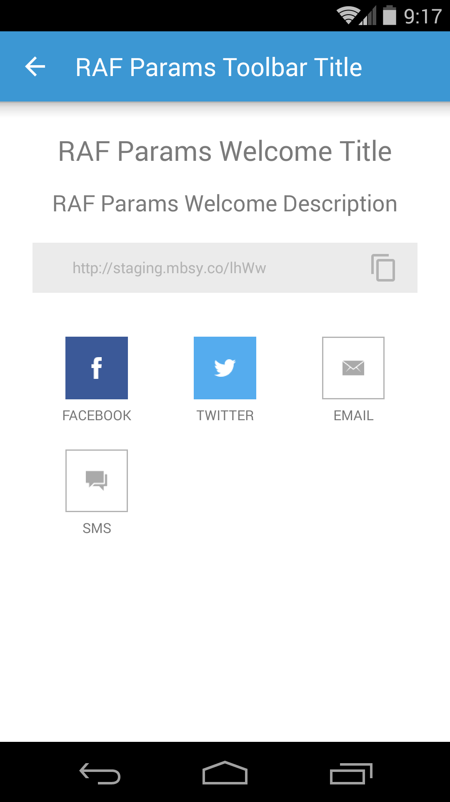

#### Reordering Share Options

To reorder share options, rearrange their positions in the array.

This is the standard ordering with Facebook appearing first and SMS last.


Reordering the SMS item to the first position will move the icon to the front.

```xml
<array name="channels">
    <item>SMS</item>
    <item>Facebook</item>
    <item>Twitter</item>
    <item>LinkedIn</item>
    <item>Email</item>
</array>
```

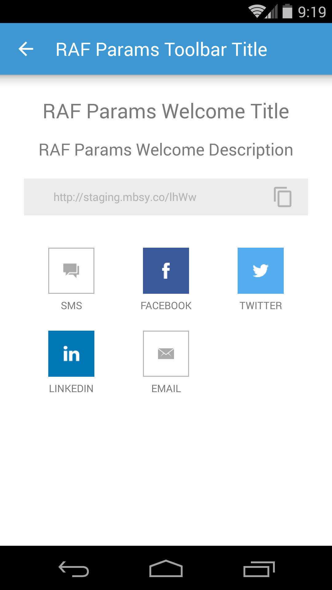

#### Corner Radius

You can set the corner radius of social options.  Modify the _socialOptionCornerRadius_ dimension value in customValues.

```xml
<dimen name="socialOptionCornerRadius">5dp</dimen>
```

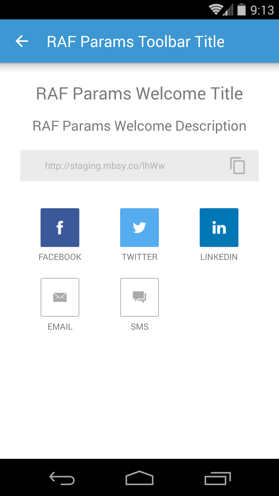

You can also display the options as circles by setting the value to -1dp.

```xml
<dimen name="socialOptionCornerRadius">-1dp</dimen>
```

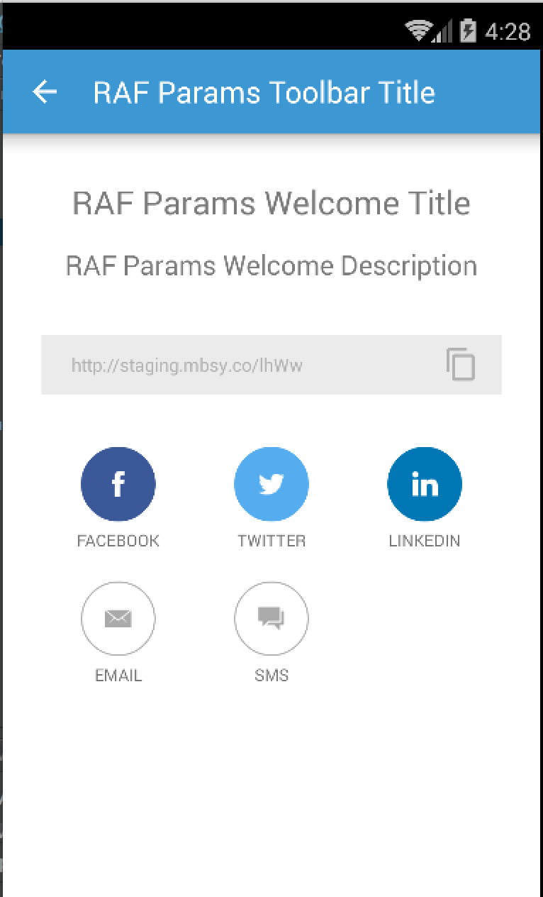
