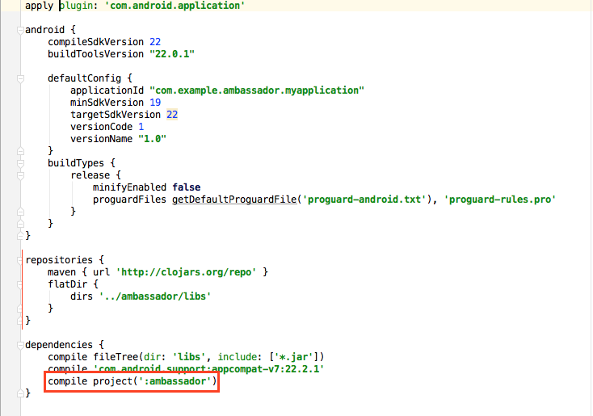
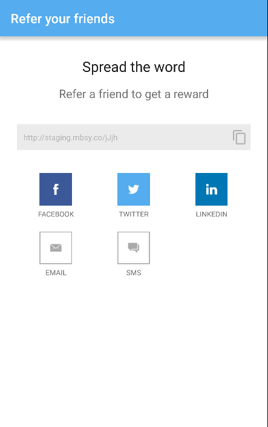
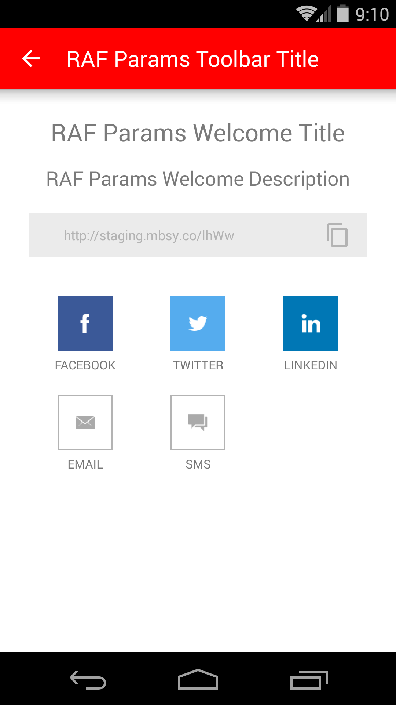
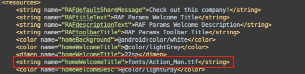

# Ambassador Android SDK
_**Support Level**_: API 16+ (4.1+)

## Getting Started

Install Git hooks:
```
ln -s ../../git-hooks/prepare-commit-msg .git/hooks/prepare-commit-msg
```

## Documentation
## Installing the SDK

Follow these steps to add the Ambassador SDK to your Android Studio project.

_**Note**_: Make sure you have the latest version of **Android Studio** installed.

* Download the zip file, unzip it, and leave the **'ambassador'** folder on your
desktop or another place that you can easily access.

 

 * Open your project's top-level Gradle file

  

 * Add the following line under the dependencies section

  ```java
  classpath 'com.neenbedankt.gradle.plugins:android-apt:1.7'
  ```
  

* Open your project's stucture by selecting **File -> Project Stucture** in the Menu Bar to bring up a dialog in Android Studio.

 

* Click the **'+'** sign in the top left corner of the dialog.

 

* Select the **'Import Gradle Project'** option and click **'Next'**.

 

* Tap the **'...'** button and locate the **'ambassador'** folder where you chose to save it.

 

* Select the **'ambassador'** folder and click **'OK'**.

 

* Click **'Finish'** and give Android Studio a moment to finish creating the module.

 

* Once the Ambassador module has been created and added to the project, it should appear in the **Project Structure**.  You can then click the **'OK'** button to dismiss the Project Structure dialog.

 

## Modify your app's Gradle file

* Open your app's **Gradle** file that can be found in the **Project** view.

 

* Add the **repositories** code to your Gradle file with the following code:

 ```java
 repositories {
     maven { url 'http://clojars.org/repo'}
     flatDir { dirs '../ambassador/libs' }
 }
 ```
 

* Now add the **ambassador module** as a dependency to your project by inserting the following code:

 ```java
 compile project(':ambassador')
 ```
 


 ## Initializing Ambassador

 You will want to run Ambassador in your application as early in the application lifecycle as possible.  The ideal place to run would be in the **onCreate()** method of your **MainActivity**.  You will have the option to register a **conversion** the first time the app is launched.  You can read more on **conversions** and setting their parameters in [Conversions](#conversions).

 * _Note_: Your **Universal Token** and **Universal ID** will be provided to you by Ambassador.

  ```java
  @Override
      protected void onCreate(Bundle savedInstanceState) {
          super.onCreate(savedInstanceState);
          setContentView(R.layout.activity_main);

          // Use this 'run' method if you DON'T want to
          // register a conversion on the first launch of your app.
          AmbassadorSDK.runWithKeys("your_universal_key", "your_universal_ID");

          // -- OR --

          //  If you DO want to register a conversion on the first launch
          // then create a ConversionParameters object to pass to the method below
          ConversionParameters parameters = new ConversionParameters();
          // ** Would set the parameter properties here (find out more in 'Conversions' section)
          AmbassadorSDK.runWithKeysAndConvertOnInstall("your_universal_key", "your_universal_ID", parameters);
      }
   ```

## Identifying a User

 In order to track referrals and provide users with custom share links, Ambassador only needs the **email address** of the user. The call to identify a user should be done early in the app to make sure all Ambassador services can be provided as soon as possible. We recommend putting it on a **login screen** or **after the initial call to run Ambassador** if you have the user's email stored.

 ```java
 AmbassadorSDK.identify("user@example.com");
 ```

## Conversions

Conversions can be triggered from anywhere.  Common places could be an Activity's **onCreate()** method or on a **button click**.

 ```java
// STEP ONE: Create a ConversionParameters object
ConversionParameters conversionParameters = new ConversionParameters();

// STEP TWO: Set the REQUIRED properties
conversionParameters.mbsy_revenue = 10;
conversionParameters.mbsy_campaign = 101;
conversionParameters.mbsy_email = "user@example.com";

// STEP THREE: Set any optional properties that you want
conversionParameters.mbsy_add_to_group_id = "123";
conversionParameters.mbsy_first_name = "John";
conversionParameters.mbsy_last_name = "Doe";
conversionParameters.mbsy_email_new_ambassador = 0; // Boolean represented by int (Defaults to false)
conversionParameters.mbsy_uid = "mbsy_uid";
conversionParameters.mbsy_custom1 = "custom";
conversionParameters.mbsy_custom2 = "custom";
conversionParameters.mbsy_custom3 = "custom";
conversionParameters.mbsy_auto_create = 1; // Boolean represented by int (Defaults to true);
conversionParameters.mbsy_deactivate_new_ambassador = 0; // Boolean represented by int (Defaults to false)
conversionParameters.mbsy_transaction_uid = "transaction_uid";
conversionParameters.mbsy_event_data1 = "eventData1";
conversionParameters.mbsy_event_data2 = "eventData2";
conversionParameters.mbsy_event_data3 = "eventData3";
conversionParameters.mbsy_is_approved = 1; // Boolean represented by int (Defaults to true);

// STEP FOUR: Register the conversion with the ConversionParameters object
AmbassadorSDK.registerConversion(conversionParameters);
 ```

## Present the 'Refer a Friend' Screen (RAF)

The RAF Screen provides UI components that allow users to share with their contacts to become part of your referral program.

   

To launch the RAF Screen, simply add the following line to your application. The parameter _context_ refers to the current context, and the string _877_ refers to the campaign ID.

```java
AmbassadorSDK.presentRAF(context, "877");
```
Example usage in a MainActivity:
```java
Button btnRaf = (Button) findViewById(R.id.btnRAF);
final Context context = this;
btnRaf.setOnClickListener(new View.OnClickListener() {
    @Override
    public void onClick(View v) {
        AmbassadorSDK.presentRAF(context, "305");
    }
});
```

**Identify should be called BEFORE attempting to present the RAF Screen.  Identify will generate/update the short urls, and therefore should not be placed immediately before any RAF presentation calls.  This will allow the share urls to be generated for your user.  If 'Identify' is not called before, or a non-existing campaign ID is passed, you will get continuous error messages while trying to load the RAF Screen.**

#### Customizing the RAF Screen

Custom messages, colors, and font sizes are set in the file customValues.xml. Open this file in the following location in Android Studio:


The file consists of various elements with editable properties. The colors can be replaced with any hexadecimal string (ex: #ff0000). The dimen values can be replaced with any font size. The strings can be replaced with any text you wish to show on the RAF Screen.


For instance, if the color 'homeToolBar' is changed:



The resulting toolbar would display:


_Note_: If any values in this file are blank, the RAF will use the default values shipped with the SDK. The strings for the RAF Screen will revert to these:

* **toolbarTitle** - "Refer your friends"
* **titleText** - "Spread the word"
* **descriptionText** - "Refer a friend to get rewards"
* **defaultShareMessage** - "I'm a fan of this company, check them out!"

_Note_: The shortURL will automatically be appended to the defaultShareMessage

#### Using Custom Fonts

If you wish to use custom fonts in the Ambassador SDK, you must place them in your app's **assets/fonts** folder:


To use a custom font, insert the name of the font as `fonts/<your font name.extension>`.  Ex: `fonts/ExampleFont.ttf`:



By inserting the **fonts/Action_Man.ttf** value as seen above, expect the following result:


_Note_: By leaving a font value blank or entering it incorrectly, **Roboto-RobotoRegular** will be used by default.

#### Using Custom Images

A custom image can be placed on the SDK Home Screen. This is commonly used for company logos.

First, rename your image file `raf_logo.png` (must be lowercase). Then place this image in your app's drawable-mdpi folder.


_Note_: To create properly-scaled images for differing device densities, you must create an image for each android density. To read more about this, visit <a href="http://developer.android.com/guide/practices/screens_support.html" target="1">Supporting Multiple Screens</a>. If you choose to do this, place each scaled image in the proper folder (drawable-xhdpi, drawable-xxhdpi, etc.). If you choose not to do this, Android will pull the image from the mdpi folder, however it may not properly scale depending on the density of the target device.

The SDK will constrain your image to no bigger than 30dp (density-independent pixels). This is to prevent images of large height from pushing the content below it down and off the screen. There is no constraint on the width, however the image will not get cut off on either the right or the left.
